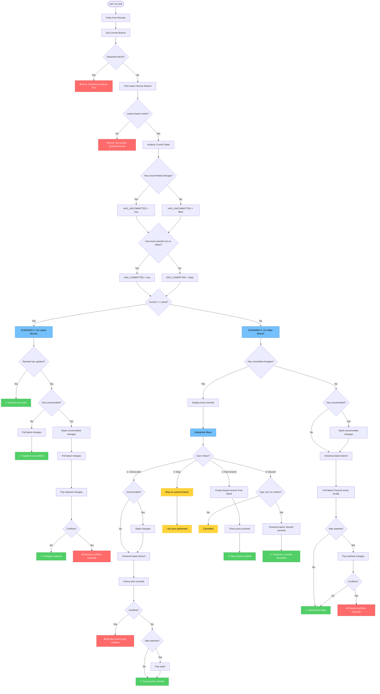

# Sync Workflow (`npm run pull`)

This document describes the intelligent sync workflow implemented in `scripts/sync-latest.sh`.

## Overview

The sync tool automatically handles different scenarios when syncing your local branch with the latest version branch from the remote repository. It prevents the problematic behavior of merging newer versions into older version branches.

## Workflow Diagram



## Scenarios Explained

### Scenario 1: Already on Latest Branch

**Scenario 1A - No uncommitted changes**
- Simply pulls the latest changes from remote
- Clean and straightforward update

**Scenario 1B - With uncommitted changes**
1. Stashes your uncommitted changes with timestamp
2. Pulls latest changes from remote
3. Restores your stashed changes
4. If conflicts occur, provides clear instructions for manual resolution

### Scenario 2: On Older Version Branch

**Scenario 2A - With committed changes (not on latest)**

Presents an interactive menu with 4 options:

1. **Cherry-pick to latest (Recommended)**
   - Stashes uncommitted changes if any
   - Switches to latest branch
   - Applies your commits one by one
   - Restores uncommitted changes if stashed
   - Best for ongoing work that should continue on latest

2. **Create new feature branch**
   - Creates a new branch from latest (named `feature-YYYYMMDD-HHMMSS`)
   - Cherry-picks your commits to the new branch
   - Useful for experimental work or feature development

3. **Stay on current branch**
   - No sync performed
   - Use when you intentionally need to work on an older version

4. **Discard commits and switch**
   - **DESTRUCTIVE** - requires typing "yes" to confirm
   - Switches to latest branch without preserving commits
   - Only use if commits were mistakes

**Scenario 2B - With uncommitted changes only (no commits)**
1. Stashes uncommitted changes if any
2. Switches to latest version branch
3. Pulls latest if branch exists locally
4. Restores uncommitted changes
5. Handles conflicts with clear recovery instructions

## Safety Features

- **No version mixing**: Never merges latest into older branches
- **Auto-stashing**: Preserves uncommitted work automatically
- **Conflict handling**: Clear instructions when conflicts occur
- **Detached HEAD detection**: Prevents operations in invalid states
- **Double confirmation**: Required for destructive operations
- **Colored output**: Visual feedback for errors, success, warnings
- **Recovery instructions**: Always tells you how to recover from errors

## Error Recovery

### Stash Conflicts
If stash restoration fails:
```bash
# Option 1: Resolve conflicts and drop stash
git stash drop

# Option 2: Discard stashed changes
git stash drop

# Option 3: View all stashes
git stash list
```

### Cherry-pick Conflicts
If cherry-pick fails:
```bash
# Option 1: Resolve conflicts and continue
git cherry-pick --continue

# Option 2: Abort cherry-pick
git cherry-pick --abort
```

## Command Reference

```bash
# Run sync tool
npm run pull

# Manual git commands (if needed)
git stash list              # View all stashes
git stash pop               # Restore most recent stash
git stash drop              # Remove most recent stash
git cherry-pick --continue  # Continue after resolving conflicts
git cherry-pick --abort     # Abort cherry-pick operation
```

## Best Practices

1. **Before syncing**: Review your changes with `git status`
2. **Regular syncing**: Run `npm run pull` frequently to stay updated
3. **Commit often**: Small, frequent commits make cherry-picking easier
4. **Clear messages**: Write descriptive commit messages for easier tracking
5. **Test after sync**: Run `npm run dev` to verify everything works after syncing
